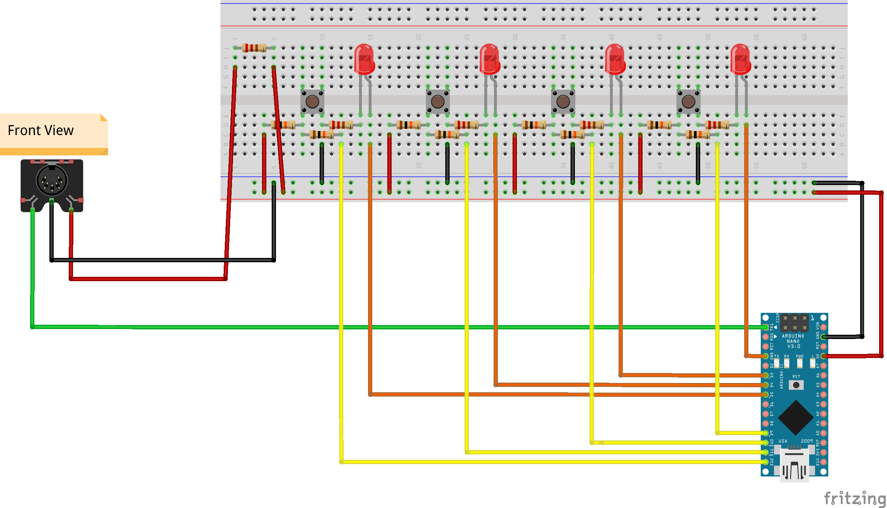

# a simple MIDI-Controller for the Line 6 POD 2.0

Right now, you can select programs 1A to 1D via one of the four buttons connected to pins 9, 10, 11 and 12.

If you are compiling the sketch on the commandline, be sure to edit the Makefile (especially the line starting
with ARDUINO_PORT, this is probably different on your computer)

Here is the wiring diagram:

